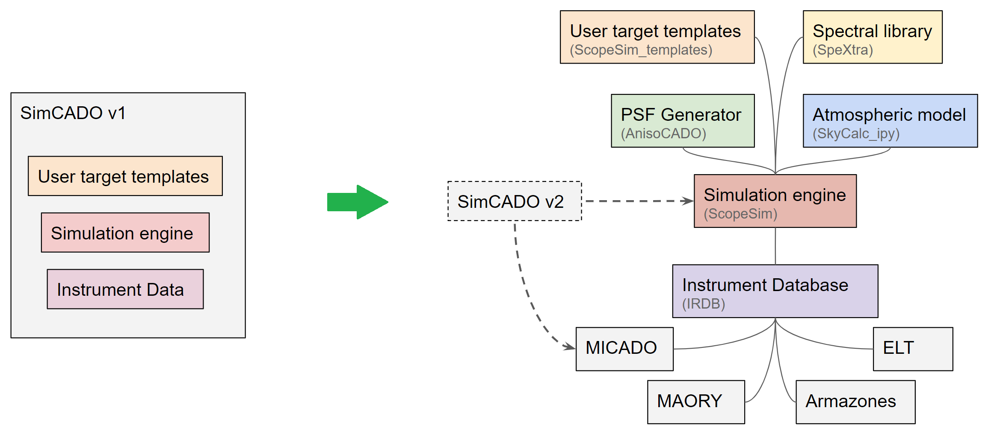

SimCADO v2 = ScopeSim + MICADO
------------------------------

SimCADO v2 combines the ScopeSim_ simulation engine with dedicated MICADO packages in ScopeSim's `instrument reference database`__

__ IRDB_

This latest iteration of SimCADO is superior to the original version in the sense that the data needed to produce the MICADO optical model is completely decoupled from the code used to simulate the observations and from the code used to describe the target source.

In a word, SimCADO has been de-spaghetti-afied.

    Left: SimCADO v1 contained everything needed to run a simulation for MICADO.
    However the inner algorithms were convoluted and interconnected.
    Right: The ScopeSim environment offers all the functionality of SimCADO v1, but with a decoupled code base.
    This allows each aspect of the simulation workflow to be updated and improved independently of all other systems.
    SimCADO v2 essentially now consists of a data package in the IRDB and utilises the in-built Effect object nativce to ScopeSim.

SimCADO_ v1 contained everything needed to run a simulation for MICADO.
However the inner algorithms were convoluted and interconnected.
The ScopeSim environment offers all the functionality of SimCADO v1, but with a decoupled code base.
This allows each aspect of the simulation workflow to be updated and improved independently of all other systems.
SimCADO v2 essentially now consists of a data package in the IRDB and a set of configuration files that utilise the in-built Effect objects native to ScopeSim.

A further advantage of using the ScopeSim architecture is that observations with MICADO can be compared directly with observations with other telescopes and instruments quickly and efficiently on a common platform.

.. _SimCADO: https://simcado.readthedocs.io/en/latest/
.. _ScopeSim: https://scopesim.readthedocs.io/en/latest/
.. _IRDB: https://github.com/astronomyk/irdb
.. _ScopeSim_Templates: https://scopesim-templates.readthedocs.io/en/latest/
