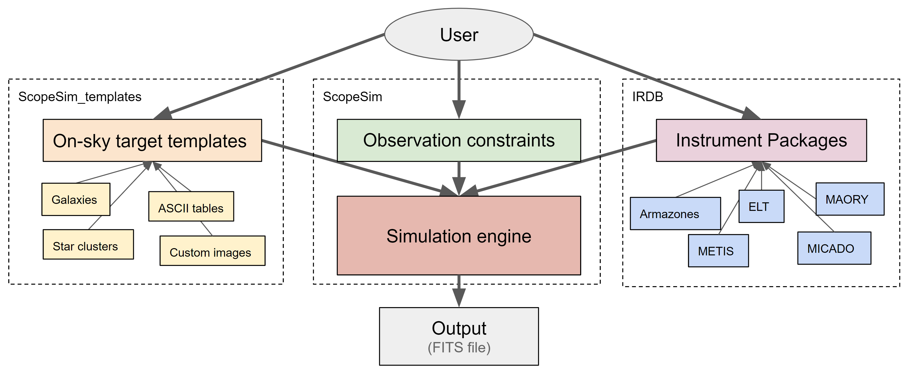

Building blocks
---------------

The ScopeSim ecosystem has been designed to maintain strict boundaries between the simulation code, the optical model data, and the user input.
As with real systems, the astronomical objects and the light they emit have nothing to do with the telescope or astronomer.
The telescope and instruments also exist independently of the astronomer.
Only when an astronomer uses a telescope to observe a celestial object, do the three engage (albeit passivley) with each other.
A similar philosophy has been applied to the development of the ScopeSim ecosystem.

The ScopeSim ecosystem consists of three main packages:

- ScopeSim: the core simulation engine,
- ScopeSim_templates: a library of function for generating descriptions of on-sky objects,
- IRDB: The instrument reference database containing the data and configuration files needed to generate the digital models of a range of telescope and instrument optical system.

Figure \ref{fig-ecosystem} illustrates the relationship between these three packages.
Although there is a strict delineation between the scopes of each package, the interfaces between the packages allows them to interact almost seamlessly with each other.
This can be seen in the code examples from section \ref{sec-examples}.
The main code pattern is the same for all use cases:

1. download the required instrument packages from the instrument reference database (IRDB) using scopesim,
2. create a description of the astronomical object using scopesim_templates,
3. generate a model of the desired optical system using scopesim and referencing the IRDB,
4. simulate and output the observed data using scopesim.

Description of on-sky targets
+++++++++++++++++++++++++++++
- Spatial + spectral descriptions
- ScopeSim_templates package

Optical Model data
++++++++++++++++++
- What is an Instrument packages
- What do they contain
- Where are they found

Observation simulator engine
++++++++++++++++++++++++++++
- Uses data from package to create a model
- Manages the transport of photons from the on-sky object to the detector plane
- Sequentially alters the distrobution of flux according to the instrumentions in the inst pkg
- Outputs the final photon distibution in FITS format for the end user

