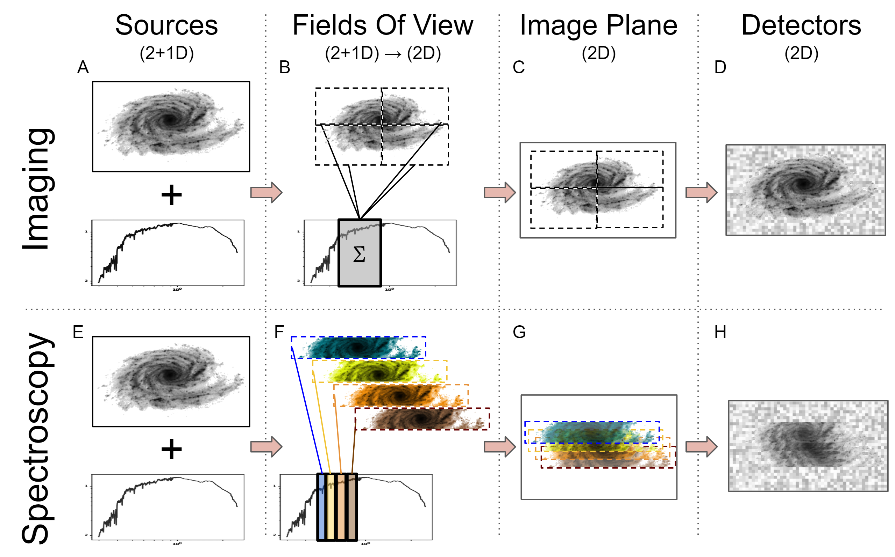
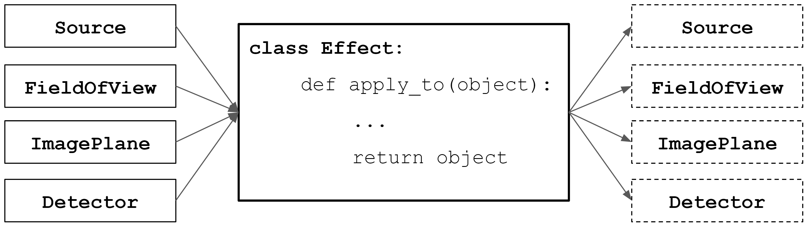

ScopeSim Architecture
---------------------

In order to work as a multi-purpose optical* instrument simulator, ScopeSim needs to be able to handle (at least) the two main types of instruments: imagers and spectrographs.

*Footnote: Optical refers to the wavelength ranges where telescopes act as "photon buckets" and detectors are in essence "photon counters".
In other words, from the near ultraviolet (0.1um) to the mid infrared (~30um).
While every instrument is unique, all instruments, by virtue of their astronomical nature, have several key aspects in common.
All instruments:

- transport incoming photons through an optical system towards a detector (array),
- use a limited number of optical components, e.g: mirrors, lenses, and gratings,
- are only a single element in a combined optical train, which includes the atmosphere, telescope, and relay optics,
- introduce a series of optical aberrations depending on the configuration of the optical system,
- are generally built to behave in a predictable and repeatable manner.

These 5 points are important to recognise, as they have the following consequences:

- each optical element is responsible for one or more optical aberrations, which are not dependent on the aberrations inherent to the other optical elements,
- the effect of each aberration on the spatial and spectral distribution of photons remains constant for a given optical configuration,
- this constancy means the characteristics of these effects need only be calculated once and can be described by an analytical function, or an empirical data set,
- common elements (e.g. telescopes, atmospheres, etc.) of complex optical trains can be re-used with different instruments to create new combined optical systems.

This list of consequences implies that the final observed image from a telescope/instrument optical system is simply the sum of a discrete number of independent optical effects repositioning the incoming photons on the focal plane.

While this conclusion may seem obvious and trivial, by using it as the basis for scopesim, it has allowed us to design and build a flexible, lightweight, general purpose instrument simulator that is capable of simulating the majority of current and future optical astronomical instruments.
ScopeSim is able to mimic the optical aberrations seen in imagers, long-slit and multi-object spectrographs, as well as integral field spectrographs.
The architecture could also theoretically be used to simulate high contrast and high time resolution imagers, however these systems have not yet been tested.

Simulation workflow
+++++++++++++++++++

The main ScopeSim engine architecture is based around 5 major python classes:

- **Source**: holds a spectro-spatial description of the on-sky target.
- **FieldOfView**: extracts quasi-monochromatic flux maps from a Source object and projects these into focal plane coordinates.
- **ImagePlane**: mimics the focal plane and acts like a 2D canvas for collecting the flux maps held in the FieldOfView objects.
- **DetectorArray**: mimics the functionality of the instrument Detector array in converting the final expectation flux image from the ImagePlane into FITS format pixel maps similar to those delivered by the systems read-out electronics.
- **Effect**: the interface base class for introducing spectral and spatial aberrations into the final flux map.

    An illustration of the connections between the main internal classes in ScopeSim: Source, FieldOfView, ImagePlane, DetectorArray.
    The upper panels show the work flow for imaging simulations.
    The lower panels show the work flow for spectroscopy simulations.
    The work flow is in principle the same for both types of simulation.
    (A, E) Both modes require a 2+1D description of the on-sky target(s) containing linked spatial (2D) and spectral (1D) information.
    The main difference lies in how and where the spatial and spectral borders for each of FieldOfView objects are set.
    FieldOfView objects (B, E) extract (2D) integrated photon maps from the Source object(s) and project these onto an ImagePlane objects, which creates a normalised expectation image, similar to what happens at the detector focal plane in a real instrument.
    The DetectorArray (D, H) extracts the regions of the ImagePlane that each detector would see.
    Simulation output in both imaging and spectroscopic cases is the same: A FITS file with detector read images in the same format as generated by the real instrument.

Figure \ref{fig-workflow} illustrates how the first 4 of these classes interact with each other.

The Source objects (A, E) are supplied by the user.
These contain a 2+1D description of the on-sky target(s).
The spatial (2D) information is stored either as tables (collection of point sources) or as ImageHDU objects (for extended objects).
Each of the spatial ``fields`` must be accompanied by one or more unique spectrum.
There need not be a one-to-one relationship between the spatial and spectral inputs.
Multiple spatial fields can reference a single spectrum.
In doing so, ScopeSim can vastly reduce the amount of data that needs to be processed.
For example, a star cluster will contain many thousands of point sources.
However only several tens of spectra are needed to adequately describe all the stars in the cluster.
There will be many hundreds of M-type stars that can reference a single common M-type stellar spectrum.

ScopeSim builds a model of the optical train by importing instrument packages.
Based on the list of Effects contained in the configuration files, ScopeSim splits the full spectral and spatial parameter space of the instrument into 3D ``puzzle'' pieces, known as FieldOfView objects.
Each FieldOfView object (B, F) then extracts only the flux from the Source object that fits within its sprecto-spatial limits.
This process essentially creates a series of quasi-monochromatic puzzle pieces from the 2+1D source flux.
The spatial size and spectral depth of each puzzle piece is determined by which optical effects are included in the optical model.
For imager instruments where chromatic effects rarely play a large role, the spectral depth of each FieldOfView object will be relatively large.
It is not uncommon for the spectral depth to be equal to the spectral width of the filter bandpass.
The on-sky area for imager is generally very large and so the viewing area is split into multiple pieces.
This is illustrated in the upper half of panel B in Figure \ref{fig-workflow}.
For spectrographs, the spatial component is generally small (e.g. long slits, MOS fibre heads).
The spectral space however must be very finely sampled to accurately reproduce the spectral traces on the focal plane.
Spectrographic optical systems therefore contain many FieldOfView objects which cover the same on-sky spatial region, yet cover very shallow and unique spectral ranges.
The FieldOfView objects also contain two sets of spatial coordinates which connect the objects position on sky (in units of arcseconds from the optical axis) to the projected position on the detector focal plane (in units of millimeters from the optical axis).

The ImagePlane (C, G) inside each optical model acts as a 2D canvas for the integrated flux contained inside the FieldOfView objects.
When each FieldOfView object deposits its flux map onto the ImagePlane, it simple adds the photon counts to what is already on the canvas at the FieldOfViews projected focal plane position.
The resulting ImagePlane image is therefore the final integrated projected expectation flux map as would exist at the detector focal plane of a real image, in units of [ph s-1 pixel-1]
All information on telescope aperture, viewing angle, and spectral bandpass has been integrated into the normalised photon count map - thus the name ``expectation'' flux map.
At this stage of the simulation all sources of background flux (atmospheric, thermal) have also been projected onto the ImagePlane, however no noise characteristics are included.

The DetectorArray class contains a list of Detector objects (D, H).
Detector objects extract a region of the ImagePlane's expection flux map corresponding to its own footprint on the detector focal plane and scales this to match the user's desired exposure time (DIT in seconds).
The resulting image is the flux that a real detector would register in an ideal world.
At this point all noise characteristics are introduced, e.g. shot noise, read noise, dark current, etc.
The final detector output is returned in the form of a FITS HDUList.

Effects Objects
+++++++++++++++

    Effect objects are similar to matrix operator in mathematics.
    What goes in must come out.
    Each Effect object has a single point of entry: the ``apply_to'' method, which can accept any one of the 4 major ScopeSim classes.
    This method is responsible for applying optical aberrations to the flux distribution contained within those 4 major flux container classes.

A further special and arguably the most important ScopeSim class is the Effect object.
Effect objects are responsible for applying any and all optical aberrations to the flux descriptions contained in the other 4 major flux container classes.
Effect objects can contain code to alter the flux descriptions in a multitude of manners, from simple 0D alterations like adding a dark current to each pixel, to the 3D chromatic shear caused by atmospheric refraction.
In short Effect object can be classified according to the dimensionality of their alterations to the flux descriptions:

- 3D: Effects are spatially and spectrally dependent aberrations, e.g: the broadband point spread function, atmospheric diffraction, etc.,
- 2D: Effects are only spatially dependent, e.g: telescope vibration and wind shake, pupil tracking rotations, etc.,
- 1D: Effects are only spectrally dependent, e.g: reflection and transmission curves, quantum efficiency, etc.,
- 0D: Effects are spectrally and spatially independent. This are primarily effects that are related to photons counts and electronic noise sources, e.g: poisson shot noise, read-out noise, exposure stacking, detector linearity, etc.

Higher dimensional Effects are also possible albeit very rare, e.g. field varying PSFs.

Functionally, the Effect class is similar to a quantum mechanical operator.
What goes in must come out.
In other words, if a Source object is the input to an Effect objects ``apply_to'' function, then a Source object will also be returned.
The Effect object may alter the distribution of flux inside an object, but it must return the same object.
This is illustrated in Figure \ref{fig-effect}

During a the simulation workflow, the target object flux makes its way through the 4 main class objects described in section \ref{subsec:4_main_classes}.
While flux resides in each of these objects, the relevant Effects are sequentially applied to said object.
For example, the telescope's (chromatic) PSF is applied to each of the FieldOfView objects, as this is a spectrally dependent spatial (3D) effect.
In contrast the wind-shake gaussian PSF has no spectral dependency and is therefore only applied to the ImagePlane.

The following pseudo-code snippet describes the major steps of the simulation workflow and illustrates how and when the Effect objects interact with the 4 major flux container classes.

.. code::

    source = deepcopy(orig_source)

    for effect in source_effects:
        source = effect.apply_to(source)

    fov.extract_from(source)

    for effect in fov_effects:
        fov = effect.apply_to(fov)

    image_plane.add(fov)

    for effect image_plane_effects:
        image_plane = effect.apply_to(image_plane)

    detector.extract_from(image_plane)

    for effect detector_effects:
        detector = effect.apply_to(detector)

    detector.write_to("file.fits")

As can be seen, there is a very similar pattern.
Obviously there are a few more steps involved, in the actual ScopeSim code, however the ``observe'' method of an optical model consists of little more than a python implementation of this pseudo-code.

.. todo:: include list of effects in scopesim?

The authors of ScopeSim have already included a large number of standard Effects in the ScopeSim core package.
It is clear however that there are many more that could be added.
Community participation is always welcome.
The Effect object interface has been intentionally kept light weight to encourage users to implement their own custom effects for their own simulations.
The online documentation contains a tutorial on how to write custom effects.
Users are thus cordially invited to submit any custom Effects they deem useful to the wider communuty to the ScopeSim package as a pull request via the Github repository.
